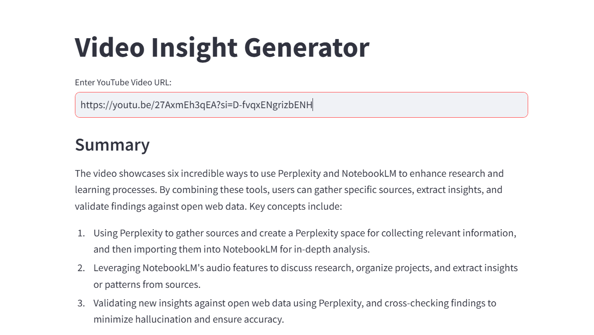
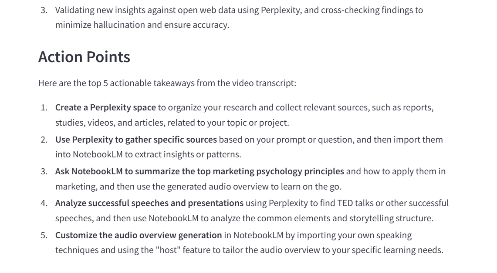

# YouTube Insight Generator

## Project Overview
The YouTube Insight Generator is a web application designed to analyze YouTube video transcripts and provide concise summaries and actionable insights. It leverages advanced language models to extract key information from video content, making it easier for users to grasp essential points quickly.

### Key Features and Capabilities
- **Transcript Analysis**: Automatically fetches and analyzes video transcripts.
- **Summary Generation**: Provides a clear, informative summary of the video content.
- **Actionable Insights**: Identifies specific, actionable takeaways for viewers.
- **User-Friendly Interface**: Built with Streamlit for an interactive user experience.

### Target Use Cases
- Content creators looking to summarize their videos.
- Educators wanting to extract key points from educational content.
- Marketers analyzing video content for insights.

### Screenshots/Demos
- 
- 

## Technical Details

### Prerequisites
- Python 3.7 or higher
- Basic knowledge of Python and web applications

### Technology Stack
- **Frontend**: Streamlit
- **Backend**: Python
- **APIs**: YouTube Transcript API, OpenAI

### System Requirements
- Internet connection for API access

### External Dependencies
- `streamlit`
- `youtube-transcript-api`
- `langchain`
- `openai`

### Architecture Overview
The application consists of a frontend built with Streamlit that interacts with a backend service for fetching and analyzing video transcripts. The analysis is performed using language models from the LangChain library.

## Setup & Installation

### Step-by-Step Installation Guide
1. Clone the repository:
   ```bash
   git clone https://github.com/yourusername/YouTube_insight.git
   cd YouTube_insight
   ```

2. Create a virtual environment:
   ```bash
   python -m venv venv
   source venv/bin/activate  # On Windows use `venv\Scripts\activate`
   ```

3. Install the required packages:
   ```bash
   pip install -r requirements.txt
   ```

### Environment Setup
- Ensure you have a `.env` file in the root directory with the following variable:
  ```
  TOGETHER_API_KEY=your_api_key_here
  ```

### Configuration Instructions
- Modify the `SUMMARY_TEMPLATE` and `ACTION_POINTS_TEMPLATE` in `app.py` as needed to customize the output.

## Usage Guide

### Basic Usage Examples
1. Run the application:
   ```bash
   streamlit run app.py
   ```

2. Open your web browser and navigate to `http://localhost:8501`.

3. Enter a YouTube video URL in the input field and click "Submit" to fetch the transcript and view the analysis.

### Common Use Cases
- Summarizing educational videos for students.
- Extracting key points from marketing videos for strategy meetings.


### Configuration Options
- Adjust the `temperature` parameter in the `ChatTogether` initialization for varying response creativity.